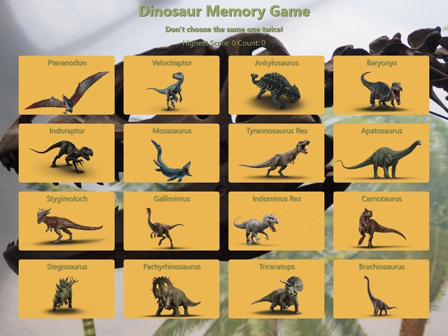

# Dinosaur Memory Game
> Challenging game with Dino-mically rendered components

## Usage

Clicking or tapping on a dinosaur starts counting how many dinosaurs have been selected. The game will shuffle the order of the dinosaurs after each click. The player must remember which dinosaurs have been selected as the game ends if they choose the same one twice. There are 16 total dinosaurs making the highest possible score 16.  

## Deployment
Deployed to [GitHub Pages](https://www.adamopenbrier.com/react-memory-game/)

## Development Setup
If you haven't already, install [Node.js](https://nodejs.org/en/download/)
This project was bootstrapped with [Create React App](https://github.com/facebook/create-react-app)  
You can learn more in the [Create React App documentation](https://facebook.github.io/create-react-app/docs/getting-started)  
To learn React, check out the [React documentation](https://reactjs.org/)  
In the project directory, you can run:  
* `npm start` - Runs the app in the development mode.  
* `npm run build` - Builds the app for production to the `build` folder.  
* `npm run deploy` - Deploys app to github pages. Must change homepage to your in package.json

## Technologies Used
- [Node.js](https://nodejs.org) - Execute JavaScript outside of the browser
- [React.js](https://reactjs.org/) - Component-based front-end framework
- [Array Random](https://www.npmjs.com/package/array-random) - Randomize array items

## Author
Adam Openbrier
 &bull; [Portfolio](https://www.adamopenbrier.com)
 &bull; [GitHub](https://github.com/aOpenbrier)  
